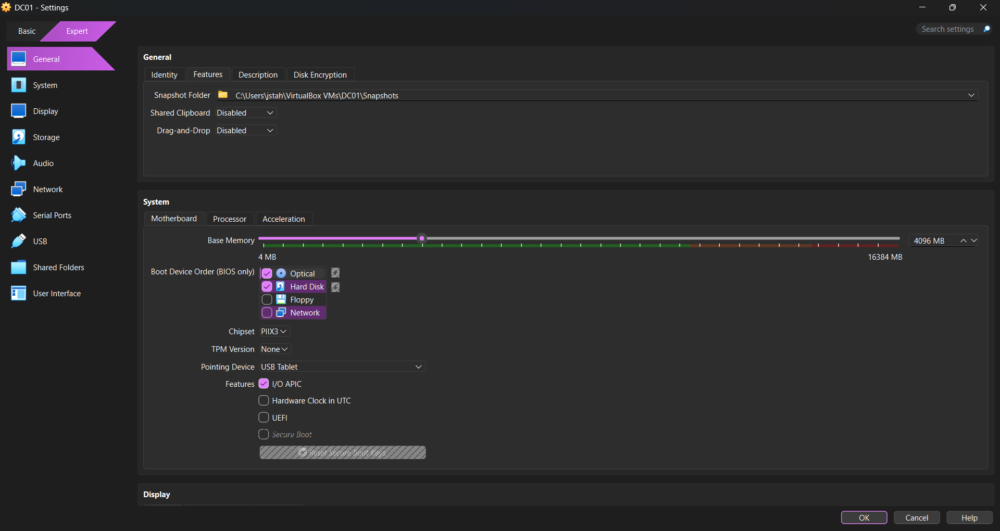
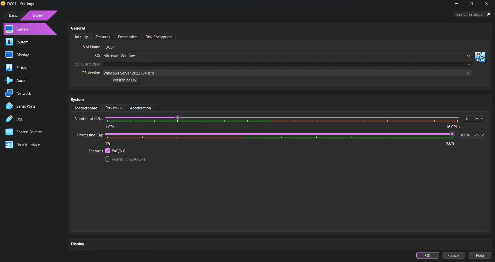
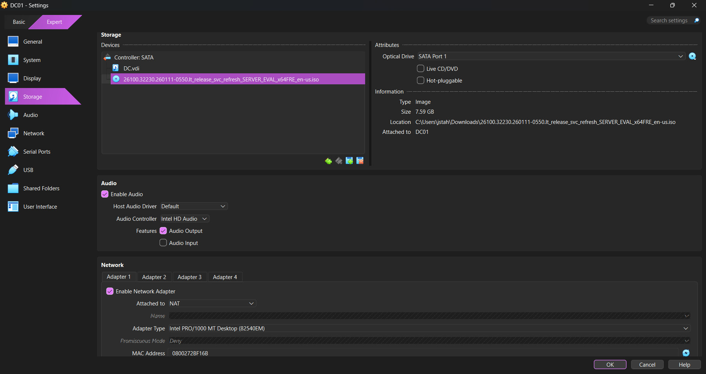

# Active Directory Homelab

## Project Overview

This project documents the deployment of a Windows Server Active Directory homelab using VirtualBox.

The environment demonstrates enterprise IT administration concepts including:

- Active Directory Domain Services (AD DS)
- DNS configuration
- Domain controller deployment
- Domain user management
- Organizational Unit (OU) management
- Workstation domain joining
- Authentication testing
- Basic Windows administration

---

## Technologies Used

- Windows Server 2022
- Windows 10 Client VM
- Active Directory Domain Services
- DNS
- VirtualBox
- PowerShell
- Command Prompt

---

## Lab Objectives

- Configure static IP addressing
- Install and configure Active Directory
- Promote server to Domain Controller
- Create and manage domain users
- Configure Organizational Units
- Join workstation to domain
- Validate authentication using command-line tools
- Practice enterprise identity management concepts

---

## Skills Demonstrated

- Windows Server Administration
- Active Directory Management
- DNS Configuration
- Identity and Access Management (IAM)
- Troubleshooting
- Virtualization
- Windows Networking
- Domain Authentication

---

## Screenshots

---

### VM Setup

Configured the Windows Server virtual machine hardware, networking adapters, and ISO installation media within VirtualBox.

---

### Windows Server Installation

Installed Windows Server and prepared the environment for Active Directory deployment.

---

### Domain Controller Networking

Configured static IP addressing, DNS settings, and validated network connectivity for the domain controller.

---

### Active Directory Installation

Installed Active Directory Domain Services and promoted the server to a Domain Controller.

---

### Active Directory Management

Created and managed domain users, Organizational Units, and security-related administrative configurations.

---

### Domain Join and Authentication

Joined the Windows client workstation to the domain and validated domain authentication functionality.

---

## Future Improvements

- Group Policy configuration
- Shared folder permissions
- PowerShell automation
- Security group management
- Additional client workstations
- Network segmentation
